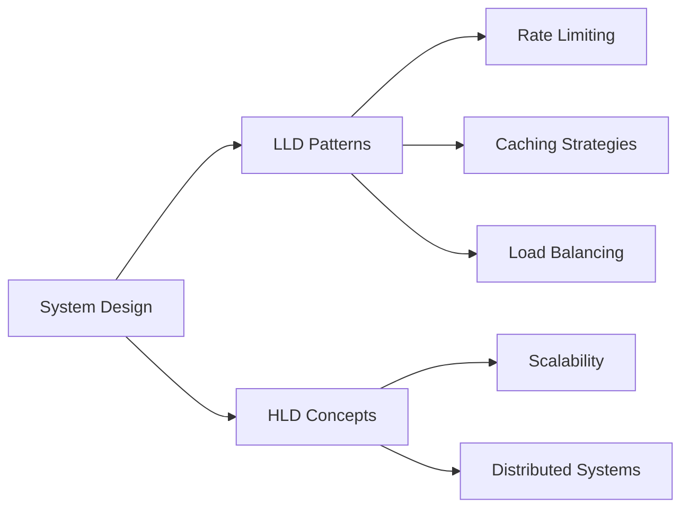

<div align="center">
  
  
  # Hi there, I'm Saurabh Maurya 👋
  
  ### Software Developer | System Design Enthusiast | Competitive Programmer
  
  [](https://www.linkedin.com/in/saurabh-maurya-ba2275188/)
  [](https://www.codechef.com/users/saurabh_9695)
  [](https://leetcode.com/saurabh_9695/)
  [](https://www.instagram.com/__saurabh__9695/)
  [](mailto:saurabhyash1707@gmail.com)
  
  
  
</div>

---

## 👨‍💻 About Me

```java
public class SaurabhMaurya {
    
    private String currentRole = "Software Developer 1 @ Boomi";
    private String[] interests = {"System Design", "Backend Development", "Competitive Programming"};
    private String location = "India";
    
    public String[] getCurrentlyWorking() {
        return new String[] {
            "🏗️  Building scalable backend systems",
            "📚  Learning advanced system design patterns",
            "💡  Solving algorithmic challenges",
            "🔧  Contributing to open-source projects"
        };
    }
    
    public String[] getExpertise() {
        return new String[] {
            "Low-Level Design (LLD)",
            "Rate Limiting Algorithms", 
            "API Development",
            "Data Structures & Algorithms"
        };
    }
}
```

- 🔭 Currently working as **Software Developer 1** at **Boomi**
- 🏗️ Passionate about **System Design** and **Architecture Patterns**
- 💻 Love building **scalable backend systems** and **clean code**
- 🧠 Strong foundation in **Data Structures & Algorithms**
- 🎯 Active **Competitive Programmer** on CodeChef & LeetCode
- 📫 Reach me at: **saurabhyash1707@gmail.com**

---

## 🚀 Featured Projects

<table>
  <tr>
    <td width="50%">
      <h3 align="center">🛡️ Rate Limiter - System Design</h3>
      <div align="center">  
        <a href="https://github.com/SaurabhMaurya9695/BackendProjects/tree/main/system-design/src/main/java/com/backend/system/design/LLD/RateLimiter">
          
        </a>
        <p><strong>Java, System Design, Design Patterns</strong></p>
        <p>Production-ready Rate Limiter implementation with 5 algorithms (Token Bucket, Leaky Bucket, Fixed Window, Sliding Window Log, Sliding Window Counter). Features modular design with Factory, Builder, and Strategy patterns.</p>
      </div>
    </td>
    <td width="50%">
      <h3 align="center">🌐 TeamCodeHub</h3>
      <div align="center">
        <a href="https://teamcodehub.herokuapp.com/">
          
        </a>
        <p><strong>MERN Stack, Full-Stack Development</strong></p>
        <p>Collaborative platform for developers to connect, share code, and work on projects together. Built with modern web technologies.</p>
      </div>
    </td>
  </tr>
</table>

---

## 🛠️ Tech Stack

### Languages


### Frontend


### Backend


### Databases


### Tools & Technologies


---

## 💡 Core Competencies

<table>
  <tr>
    <td align="center" width="25%">
      
      <br><strong>System Design</strong>
      <br><sub>LLD, Design Patterns, Scalability</sub>
    </td>
    <td align="center" width="25%">
      
      <br><strong>Backend Development</strong>
      <br><sub>REST APIs, Microservices</sub>
    </td>
    <td align="center" width="25%">
      
      <br><strong>DSA & Algorithms</strong>
      <br><sub>Problem Solving, Optimization</sub>
    </td>
    <td align="center" width="25%">
      
      <br><strong>Database Design</strong>
      <br><sub>SQL, NoSQL, Optimization</sub>
    </td>
  </tr>
</table>

---

## 📊 GitHub Statistics

<div align="center">
  
  
  
  
</div>

<div align="center">
  
  [](https://git.io/streak-stats)
  
</div>

<div align="center">
  
  
  
</div>

> **Note:** Top languages reflect the languages used in public repositories and don't indicate experience or skill level.

---

## 🏆 Competitive Programming

<div align="center">
  
  | Platform | Profile | Stats |
  |----------|---------|-------|
  | 🍳 **CodeChef** | [@saurabh_9695](https://www.codechef.com/users/saurabh_9695) | Active Problem Solver |
  | 💻 **LeetCode** | [@saurabh_9695](https://leetcode.com/saurabh_9695/) | Regular Contests |
  
</div>

---

## 📝 Latest Blog Posts & Learning

<!-- BLOG-POST-LIST:START -->
- 🛡️ **Rate Limiting Algorithms**: Implemented 5 production-ready algorithms with comprehensive documentation
- 🏗️ **System Design Patterns**: Factory, Builder, Strategy patterns in real-world applications
- 🔧 **Modular Architecture**: Building maintainable and scalable code structures
- 📚 **Low-Level Design**: Practical LLD implementations for interview preparation
<!-- BLOG-POST-LIST:END -->

---

## 🎯 Current Focus



- 🔍 Deep diving into **Advanced System Design Patterns**
- 🏗️ Building **Low-Level Design** implementations
- 📊 Exploring **Distributed Systems** architectures
- 💪 Strengthening **DSA** skills through competitive programming
- 🚀 Contributing to **open-source** projects

---

## 🤝 Let's Connect!

<div align="center">
  
  I'm always interested in collaborating on interesting projects and discussing:
  - 🏗️ System Design & Architecture
  - 💻 Backend Development
  - 🧩 Algorithmic Problem Solving
  - 🚀 Open Source Contributions
  
  **Feel free to reach out!**
  
  [](https://www.linkedin.com/in/saurabh-maurya-ba2275188/)
  [](mailto:saurabhyash1707@gmail.com)
  
</div>

---

<div align="center">
  
  ### 💭 Quote of the Day
  
  
  
  ---
  
  ### ⭐ Show some love by starring repositories you find interesting!
  
  
  
  
  ---
  
  <sub>💡 **Pro Tip:** Check out my [Rate Limiter Implementation](https://github.com/SaurabhMaurya9695/BackendProjects/tree/main/system-design/src/main/java/com/backend/system/design/LLD/RateLimiter) - A production-ready system design project!</sub>
  
  
  
</div>

